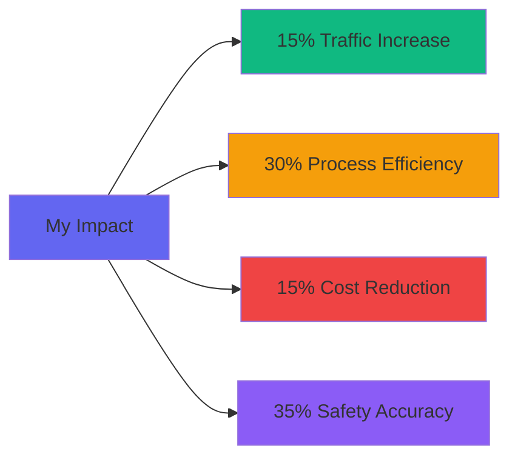

# 👋 Introducing Myself

<div align="center">
  
  
  <table>
    <tr>
      <td align="center"><b>🎯 Current Role</b><br/>Graduate Assistant @ FIU</td>
      <td align="center"><b>🎓 Education</b><br/>MS Information Systems (4.0 GPA)</td>
      <td align="center"><b>💼 Experience</b><br/>5+ Years in Analytics</td>
      <td align="center"><b>🏆 Certifications</b><br/>Oracle | Microsoft | Six Sigma</td>
    </tr>
  </table>
</div>

---

## 🎓 About Me

Hello! I'm **Rithanya Sekar**, a Graduate student specializing in **Information Systems** at Florida International University with expertise in building scalable data systems, interactive dashboards, and cloud-based analytics solutions.

- 🔭 Currently working as **Graduate Assistant** at FIU's Academic Space Management
- 🌱 Specializing in **Data Science**, **Machine Learning**, and **Business Intelligence**
- 💼 5+ years of experience in **Business Analysis** and **Data Analytics**
- 🎯 Focused on transforming complex datasets into actionable insights
- 📊 Passionate about **ETL pipelines**, **predictive analytics**, and **data visualization**
- 🏆 Certified in **Oracle Cloud**, **Lean Six Sigma Black Belt**, and **Microsoft Business Analyst**

---

## 💼 What I Do

```python
rithanya_sekar = {
    "role": "Data Analyst | BI Developer | ML Engineer",
    "education": "MS in Information Systems @ FIU",
    "expertise": [
        "Building scalable data pipelines",
        "Creating interactive Tableau & Power BI dashboards",
        "Cloud-based analytics (AWS, Oracle, Azure)",
        "ETL development & data modeling",
        "Predictive analytics & machine learning"
    ],
    "impact": {
        "traffic_increase": "15%",
        "process_efficiency": "30% faster",
        "cost_reduction": "15%",
        "safety_accuracy": "35% improvement"
    }
}
```

---

## 🛠️ Tools & Technologies

### Languages


### Databases & Cloud


### Analytics & Visualization


### ML & Data Science


---

## 📈 Featured Projects

### 🛫 British Airways Lounge Eligibility Modeling (2025)
**Forage Simulation | Python, ML, Statistical Modeling**
- Constructed demand forecast model using EDA and statistical modeling for lounge capacity planning
- Developed eligibility lookup table for passenger categorization with ML
- Generated insights: **42% traffic in morning slots**, peak demand for mid-premium tiers
- Ensured scalability for future flight schedule changes

**Tech Stack:** `Python` `Pandas` `scikit-learn` `Statistical Analysis`

---

### 🎓 Student Learning Outcome Data Management System
**Oracle APEX | Cloud ETL | Dashboard Development**
- Designed scalable cloud-based ETL pipeline migrating multi-year student data
- Engineered optimized relational schemas for performance and data integrity
- Built interactive Oracle APEX dashboards for accreditation reporting
- Improved stakeholder communication through trend visualization

**Tech Stack:** `Oracle APEX` `Cloud ETL` `SQL` `Data Modeling`

---

### 🏥 AI-Driven Clinic Operations & Predictive Analytics
**Predictive Analytics | Cloud Pipelines | BI Solutions**
- Applied predictive analytics to integrate patient records and schedules
- Conducted EDA uncovering no-show rate drivers and patient flow patterns
- Engineered comprehensive BI solution with unified cloud-based system
- Improved clinic resource allocation through data-driven insights

**Tech Stack:** `Python` `AWS` `Predictive Analytics` `EDA` `BI Tools`

---

## 🏆 Certifications

<div align="center">

| Certification | Issuer | Year |
|--------------|--------|------|
| 🌩️ **Oracle APEX Cloud Developer Professional** | Oracle | 2024 |
| 📊 **Oracle Cloud Infrastructure Data Science Professional** | Oracle | 2025 |
| 🎯 **Lean Six Sigma Black Belt - Level III** | - | 2024 |
| 💼 **Microsoft Business Analyst Professional** | Microsoft | 2024 |

</div>

---

## 📊 Key Achievements & Impact



- 🚀 **15% Organic Traffic Increase** through SEO and data-driven analysis
- ⚡ **30% Processing Time Reduction** via automated tracking systems
- 💰 **15% Expenditure Reduction** by optimizing data flow for 20+ clients
- 🎯 **35% Safety Report Accuracy Improvement** through strategic data collection

---

## 💡 Core Competencies

<table>
<tr>
<td valign="top" width="50%">

### 📊 Data & Analytics
- Data Science & Machine Learning
- Exploratory Data Analysis (EDA)
- Statistical Analysis & Predictive Analytics
- Data Visualization & Storytelling
- ETL Development & Data Modeling

</td>
<td valign="top" width="50%">

### 💼 Business Intelligence
- BI Systems Administration
- Dashboard Development (Tableau, Power BI)
- Stakeholder Communication
- Agile Methodologies
- Lean Six Sigma Process Improvement

</td>
</tr>
</table>

---

## 📫 Connect with Me

<div align="center">

[](https://linkedin.com/in/rithanya-sekar)
[](mailto:rseka002@fiu.edu)
[](#)
[](https://github.com/rithanyasekar)

</div>

---

## 📈 GitHub Stats

<div align="center">
  
  
</div>

<div align="center">
  
</div>

---

## 🎯 Current Focus

- 🔭 Building AI-powered analytics solutions
- 🌱 Exploring LLM applications in business intelligence
- 💡 Contributing to open-source data science projects
- 📚 Advancing cloud-based ETL architectures
- 🤝 Seeking collaboration on ML & BI projects

---

<div align="center">
  
### 💬 "Transforming complex data into actionable insights, one dashboard at a time."


</div>

---

<div align="center">
  
</div>
